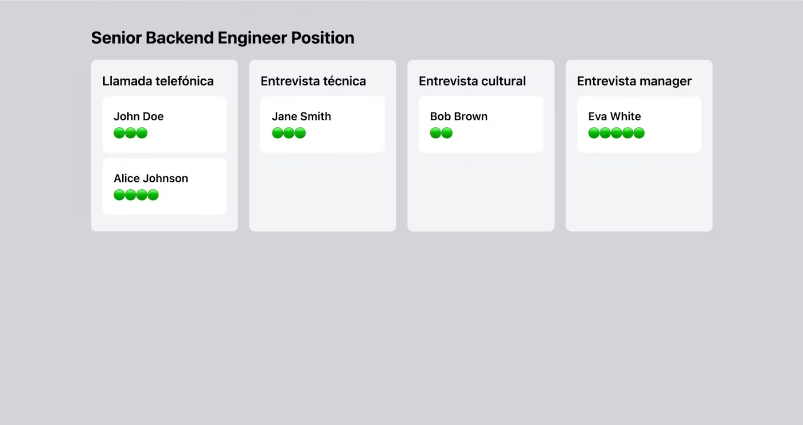

# PRD — Interfaz Kanban de Posición

## 1. Resumen ejecutivo

Se requiere una nueva página **"Position"** que permita visualizar y gestionar los candidatos de una posición específica mediante una interfaz tipo **Kanban**. Los candidatos se representan como tarjetas distribuidas en columnas que corresponden a las fases del proceso de contratación. La fase de un candidato se actualiza arrastrando su tarjeta de una columna a otra (drag & drop).

---

## 2. Contexto y problema

Actualmente no existe una vista que permita visualizar de forma clara en qué fase del proceso de contratación se encuentra cada candidato de una posición. Se necesita una interfaz intuitiva que facilite tanto la consulta rápida del estado como la gestión del avance de candidatos entre fases.

---

## 3. Objetivos del producto

- Ofrecer una vista Kanban clara del estado de todos los candidatos de una posición.
- Permitir mover candidatos entre fases de forma rápida mediante drag & drop.
- Proporcionar información relevante de cada candidato (nombre y puntuación) de un vistazo.

---

## 4. Usuarios objetivo

- Reclutadores internos
- Hiring managers
- Equipo de RRHH

---

## 5. Requisitos funcionales

### RF1 — Título de la posición

Mostrar el nombre de la posición en la parte superior de la página para dar contexto al usuario.

### RF2 — Navegación de retorno

Incluir una flecha a la izquierda del título que permita volver al listado de posiciones.

### RF3 — Columnas dinámicas por fase

Mostrar tantas columnas como fases tenga el proceso de contratación. Las fases se obtienen del endpoint `GET /positions/:id/interviewFlow` y se ordenan según `orderIndex`.

### RF4 — Tarjetas de candidato

Cada tarjeta muestra:

- **Nombre completo** del candidato.
- **Puntuación media** representada visualmente con **puntos verdes** (un punto por cada unidad de puntuación).

Las tarjetas se ubican en la columna correspondiente a su fase actual (`currentInterviewStep`).

### RF5 — Ordenamiento de tarjetas

Dentro de cada columna, las tarjetas se ordenan por **puntuación media de mayor a menor**.

### RF6 — Drag & drop entre columnas

El usuario puede arrastrar una tarjeta de una columna a otra para actualizar la fase del candidato. Al soltar la tarjeta:

1. Se realiza una llamada al endpoint `PUT /candidates/:id/stage` con el `currentInterviewStep` correspondiente a la columna destino.
2. Si la llamada es exitosa, la tarjeta permanece en la nueva columna.
3. Si la llamada falla, la tarjeta **vuelve automáticamente a su columna original** y se muestra un **mensaje de error** al usuario.

### RF7 — Integración con API

| Endpoint | Método | Uso |
|---|---|---|
| `/positions/:id/interviewFlow` | GET | Obtener nombre de la posición y fases del proceso |
| `/positions/:id/candidates` | GET | Obtener candidatos con su fase actual y puntuación |
| `/candidates/:id/stage` | PUT | Actualizar la fase de un candidato |

---

## 6. Requisitos no funcionales

### RNF1 — Diseño responsive

En dispositivos móviles, las columnas de fases deben mostrarse en **disposición vertical**, cada una ocupando el **ancho completo** de la pantalla.

---

## 7. Supuestos y restricciones

- La página de listado de posiciones ya existe y es el punto de entrada a esta vista.
- La estructura global de la aplicación (menú superior, footer) ya existe. Esta funcionalidad se implementa como **contenido interno** de la página.
- Los endpoints API descritos están disponibles y operativos en el backend.

---

## 8. Fuera de alcance

- Creación, edición o eliminación de posiciones.
- Creación, edición o eliminación de candidatos.
- Creación o modificación de fases del proceso de contratación.
- Menú superior, footer u otros elementos de layout global.

---

## 9. Referencia visual

Se adjunta imagen de referencia proporcionada por el equipo de diseño que ilustra la disposición Kanban esperada: título de posición, columnas por fase, y tarjetas con nombre y puntuación en puntos verdes.

